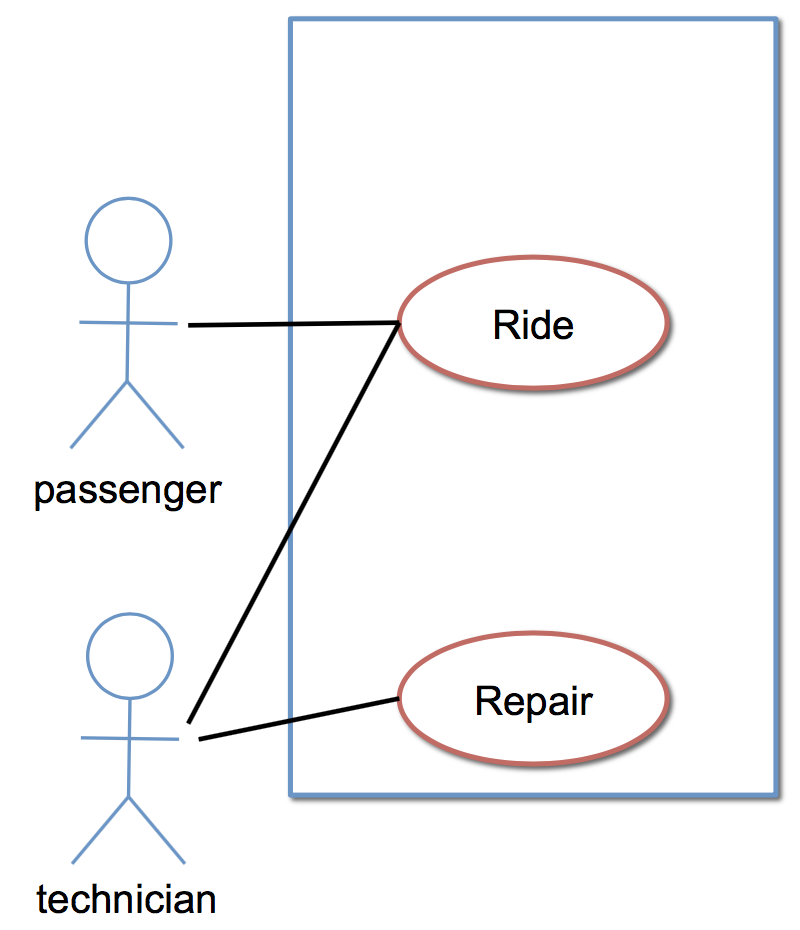
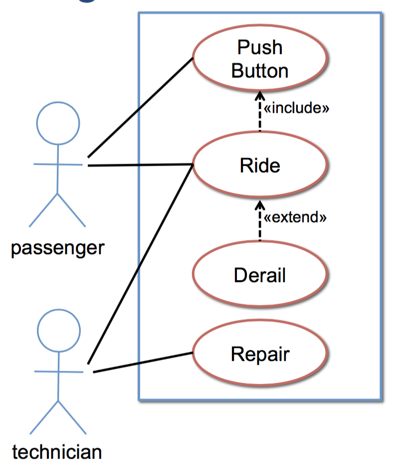
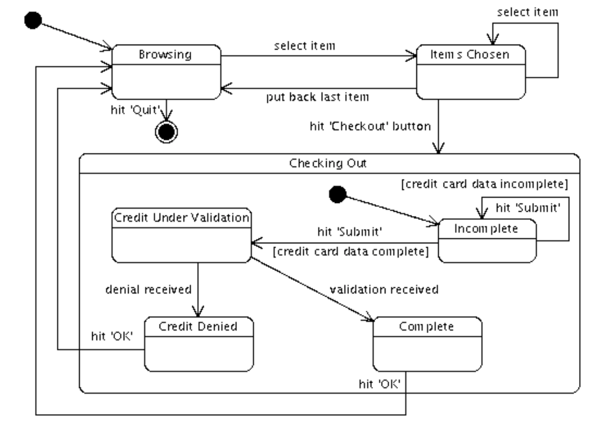
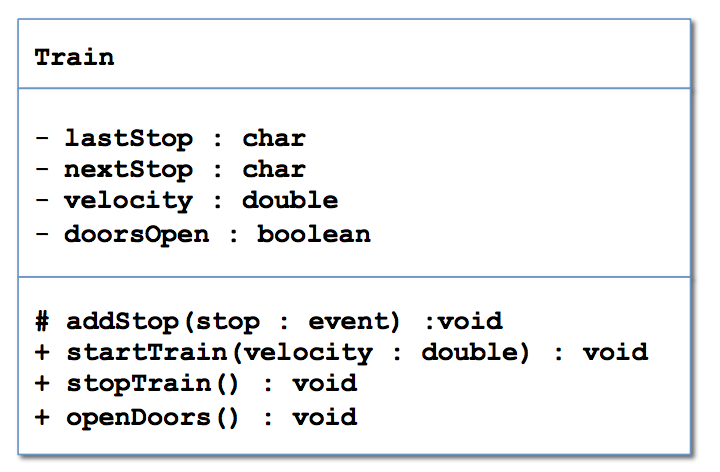
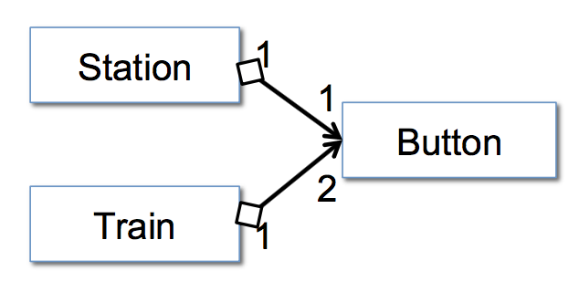
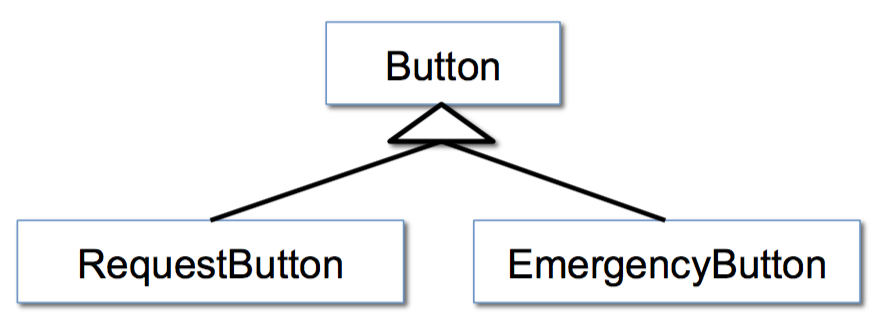
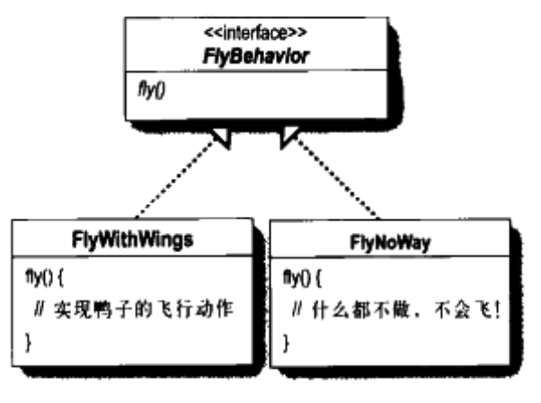
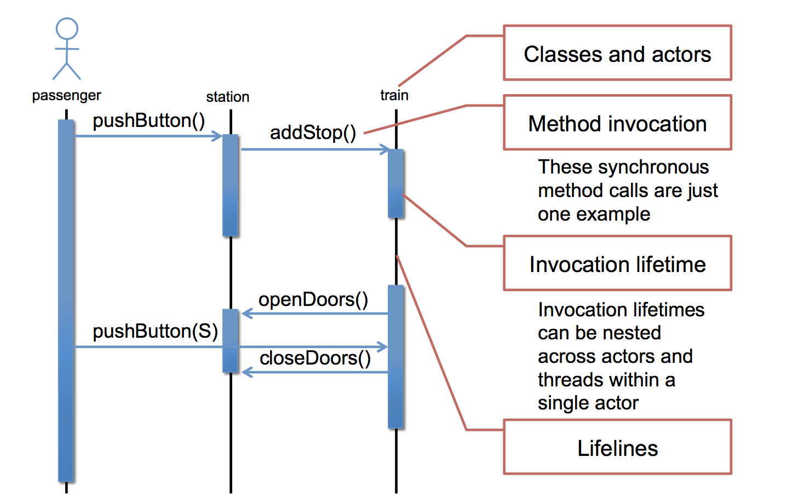
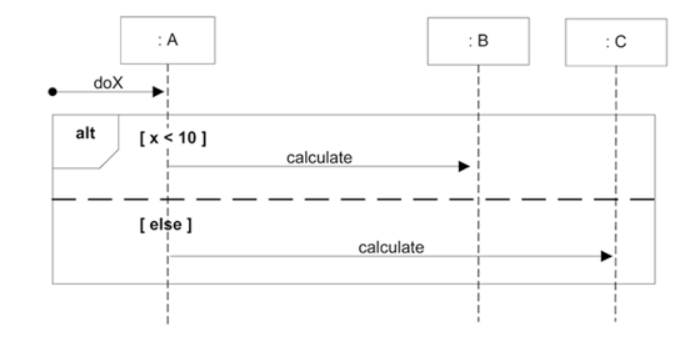

# Unified Modeling Language

#### Content

- static modeling: <u>class diagrams</u>  [fixed, **code-level**]
- behavioral modeling: 
  - <u>use case diagrams</u>
  - sequence diagrams
  - <u>state diagrams</u>
  - activity diagrams
- class relationships

1. use case diagram



火柴人代表了Actor，椭圆代表了use case

Actor是可以调用use case的一个角色

一个用户可以担当多个Actor

连线表示了association的关系



use cases之间存在关系

- inclusion(*include*) (e.g. *push button* include in ride)
- extention(*extend*) (e.g. *derail* is an exceptional ride) —— exception
- Generalization/specialization 泛化和具化 (e.g. *push train button* is specialization of *push button*)


2. statechart diagram



黑色实心圆圈代表了起始状态 **initial state**

方块代表了**state** ==> a modeled entity for which some action is performed, some stimulus is received, or some condition is met elsewhere in the system

两个state之间的连线代表了**transition**

state上，transition上都会有**action**

多个action组成**activity**


3. class diagram

> Models the **static** relationships between the components of a system.



*Note*: The multiplicity of a class is specified by a number in the upper right corner of the component. 类的多重性由组件右上角的数字制定，通常会省略因为一般来说是大于1，如果指定是1那说明这个class是一个singleton（单例）。

---

### Class Relationships 

>  引自  [UML图中的六大关系](https://my.oschina.net/jackieyeah/blog/224265)

- (依赖)Dependency : 


依赖(Dependency)描述的是一个类的引用用作另一个类的方法的参数。

例如，可以使用Calendar类中的setTime(Date date)方法设置日历，所以Calendar和Date之间的关系可以用依赖描述。

```java
public abstract class Calendar {
     public final void setTime(Date date) {
        setTimeInMillis(date.getTime());
    }
}
```


- (关联)Association：


关联描述两个类之间行为的一般二元关系。[has-a]

例如，一个学生选修一门特定的课程是学生类Student和课程类Course之间的一个关联，而一个教师教授一门课程是师资类Faculty和课程类Course之间的一个关联。Java代码中，关联可以用属性和方法来实现。

```java
public class Student {
    private Course[] courses;
          
    public void addCourse(Course s) {
        . . . . . .
    }
}

public class Course {
    private Strudent[] students;
    private Faculty faculty;

    public void addStudent(Student s) {
        . . . . . .
    }

    public void setFaculty(Faculty faculty) {
        this.faculty = faculty;
    }
}

public class Faculty {
    private Course[] courses;
           
    public void addCourse(Course s) {
        . . . . . .
    } 
}
```


- (聚合)Aggregation：



聚合是一种特殊的关联(Association)形式，表示两个对象之间的所属(has-a)关系。

例如，一个公司有很多员工就是公司类Company和员工类Employee之间的一种聚合关系。被聚合对象和聚合对象有着各自的生命周期，即如果公司倒闭并不影响员工的存在。

```java
public class Company {
    private List<Employee> employees;
}

public class Employee {
    private String name;   
}
```


- (组合)Composition：


聚合是一种较弱形式的对象包含(一个对象包含另一个对象)关系。较强形式是组合(Composition).。在组合关系中包含对象负责被包含对象的创建以及生命周期，即当包含对象被销毁时被包含对象也会不复存在。

例如一辆汽车拥有一个引擎是汽车类Car与引擎类Engine的组合关系。

(1)通过成员变量初始化 

```java
public class Car {
    private final Engine engine = new Engine();       
}

class Engine {
    private String type;
}
```


(2)通过构造函数初始化  

```java
public class Car {
    private final Engine engine;  
       
    public Car(){
       engine  = new Engine();
    }
}

public class Engine {
    private String type;
}
```


(3)通过延迟初始化

```java
public class Car {
    private final Engine engine;  
    public Engine getEngine() {
        if (null == engine) {
            engine = new Engine();
        }
        return engine;
    }     
}

public class Engine {
    private String type;
}
```


- (继承)Generalization(Inheritance):



继承(Inheritance)模拟两个类之间的is-a关系。强是(strong is-a)关系描述两个类之间的直接继承关系。弱是(weak is-a)关系描述一个类具有某个属性。强是关系可以用类的继承表示。

例如，Spring的ApplicationEvent是一个EventObject，ApplicationEvent和EventObject间就是一种强是关系，可以用继承描述。

```java
public abstract class ApplicationEvent extends EventObject {
    . . . . . .
}
```


- (实现)Realization:



实现(Realization)描述的是一个类实现了接口（可以是多个）。上面描述的弱是(weak is-a)关系就可以用接口表示。

例如字符串是可以被序列化的，这就可以用实现来描述。

```java
public final class String  implements java.io.Serializable, Comparable<String>, CharSequence {
    . . . . . .
}
```


---

### Interaction Diagrams


Focus on <font color=red>commnication</font> between elements.

- Sequence diagrams


1. Sequence diagrams



举例：



```java
public class A {
    public void doX() {
        if(x < 10) {
            B.calculate();
        }else {
            C.calculate();
        }
    }
}
```


